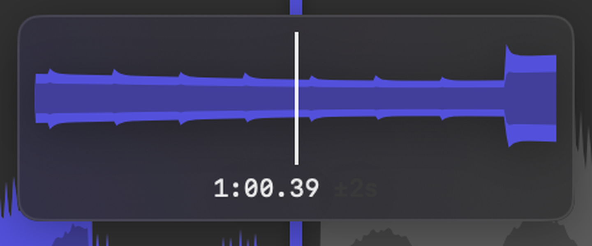
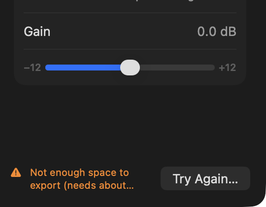
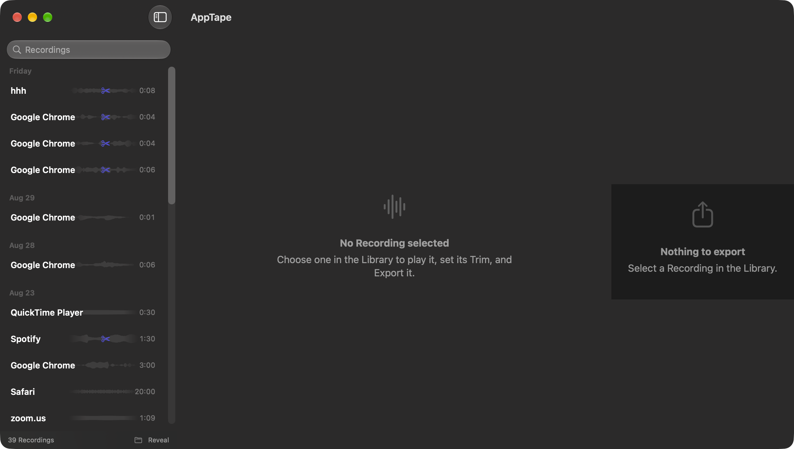
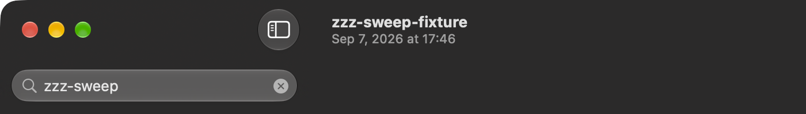
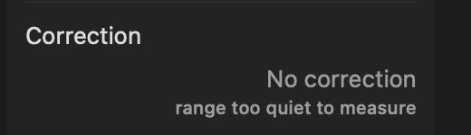
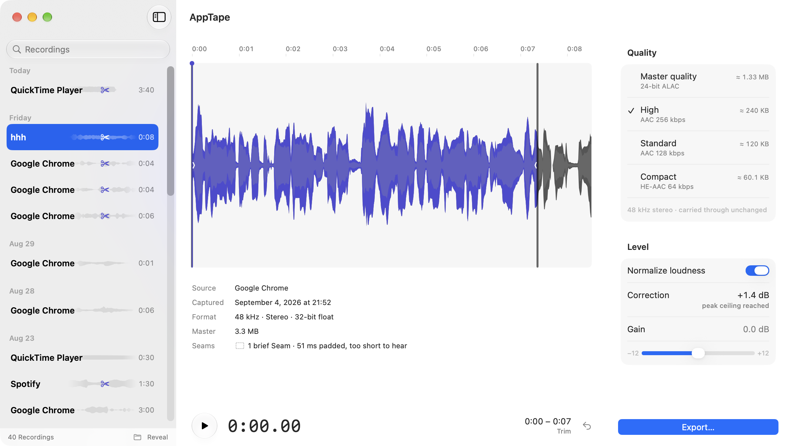
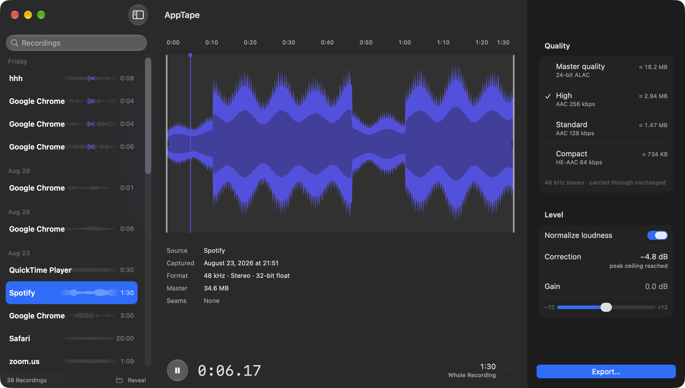
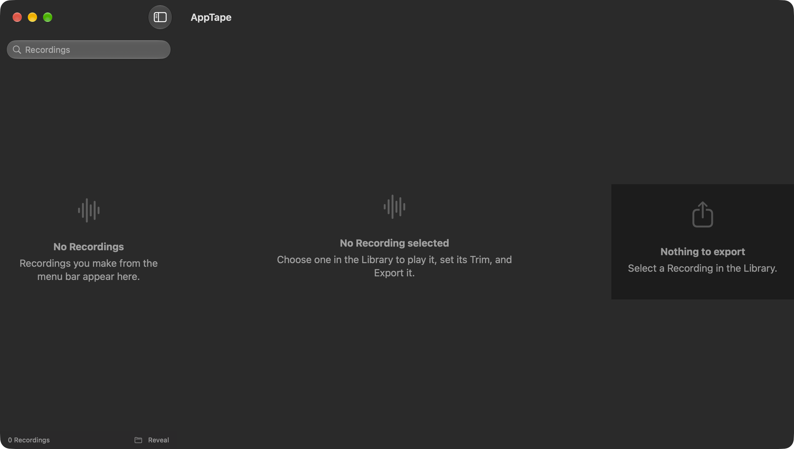

# The editor's after-picture — is the destination reached?

**Issue [#103](https://github.com/SamWongML/macos-audio-recording/issues/103), the mirror of
[#73](https://github.com/SamWongML/macos-audio-recording/issues/73).** The map
([#70](https://github.com/SamWongML/macos-audio-recording/issues/70)) says the destination is
reached *when the editor can be screenshotted in every state and read as premium, with no open
visual bug from the sweep and nothing left to decide about how it looks.* This tests that
condition against a `main` that carries all ten execution tickets.

**The answer is no, not yet — by eight findings, of which five are defects and three are
observations.** The whole of `#73`'s 38-item list holds: every finding it filed and `#76` fixed is
still fixed, and the two states `#73` could not photograph at all — the loupe and the empty
Library — are photographed here for the first time. **Both of them turned out to hold a defect,**
which is the shape of the whole report: the editor is in good order everywhere it has already been
looked at, and the damage is concentrated in the four places nobody has ever had a picture of.

## How this was captured

- Build: `main` at `85ff2a0` (the merge of [PR #102](https://github.com/SamWongML/macos-audio-recording/pull/102)),
  `-configuration Release`. **Zero warnings in the app target.**
  Release matters: in Debug the BS.1770 pass is ~82× slower ([#80](https://github.com/SamWongML/macos-audio-recording/issues/80))
  and every `Correction` row in every screenshot reads `Measuring…`. The first pass of this sweep
  was shot in Debug and thrown away for exactly that.
- Every window was **launched fresh at a saved frame** — `defaults write … "NSWindow Frame editor"`
  then `open` — never resized programmatically. That is `#85`'s harness rule and it still holds.
- Screenshots are `screencapture -x -o -l <windowID>` at 2×, in `docs/research/assets/0007/`.
- Colour figures are sampled from those PNGs and contrast is WCAG 2.x relative luminance.
- Sizes: the default **1200 × 680** ([ADR-0030](../adr/0030-the-trailing-column-sets-the-default-height.md))
  and the **960** floor, in both appearances. *The ticket says `1120 × 680`; the shipped
  `.defaultSize` is `1200 × 680` and the map's own `#97` entry agrees. The ticket's number is stale.*
- Library: the human's real 39 Recordings. Three fixtures were added and all three are gone:
  a `.wma` of random bytes for the can't-open state, a 3:40 capture of QuickTime Player for the
  during-capture states (given a hand-written `com.apptape.seams` xattr afterwards so the lane
  would draw Seam bands), and a 3 MB disk image to force the Export failure. The Library was
  moved aside for one screenshot and restored in the same shell invocation, verified 39 → 39.

### Two harness facts that changed since #73

**The loupe photographs now.** `#73` reported that *macOS suppresses screen capture system-wide
while a synthetic drag is in flight* and that the loupe therefore *needs a human's hand on the
trackpad*. That is no longer true on this OS: `screencapture -x -o -l <windowID>` returns a correct
image with the left button held down mid-drag. Every loupe picture here was taken that way, and the
first defect below is one nobody could have seen before.

**Two of the four accessibility settings still cannot be forced, and the two failures are
themselves results.** `com.apple.universalaccess` is TCC-protected exactly as `#73` found, so a
throwaway harness on
[`prototype/editor-after-sweep`](https://github.com/SamWongML/macos-audio-recording/tree/prototype/editor-after-sweep)
forces the values the shipped code reads, in-process, without touching the human's settings:

| setting | result |
|---|---|
| Reduce Transparency | **works** — the loupe swaps material, verified end to end |
| Reduce Motion | **works** — same mechanism, the two `Metrics` helpers |
| Increase Contrast | **refused by macOS.** `NSAppearance(named: .accessibilityHighContrastDarkAqua)` assigned to `NSApp.appearance` *and* to every window leaves `NSApp.effectiveAppearance.name` reading `NSAppearanceNameDarkAqua`, and the lane's three fills come back pixel-identical. `\.colorSchemeContrast` is get-only in `EnvironmentValues`, so `.environment(_:_:)` does not compile. **Still unphotographed, as in #73.** |
| large Dynamic Type | **accepted and inert.** `.dynamicTypeSize(.accessibility3)` compiles, applies, and renders a **pixel-identical** window (`ImageChops.difference(...).getbbox() is None`). macOS does not scale system fonts through Dynamic Type; its analogue is the system-wide *Text size*, which is equally unreachable from a script. |

So the ticket's state list is complete except for those two, and for both the reason is now a
measured mechanism rather than "TCC blocked it".

---

## Defects

### 1. The loupe's `±2 s` caption is invisible in Dark Mode — measured 1.07 : 1



`TrimTimeline.swift:364` draws the scale caption as `.font(.caption2).foregroundStyle(.tertiary)`
over the loupe's `.regularMaterial`. Sampled from `07-dk-1200-drag-loupe.png`: the **brightest**
pixel in any `±2s` glyph is `(57, 57, 57)` against a panel fill of `(53, 52, 56)` —
**1.07 : 1**, against a 4.5 : 1 floor for text this size. The figure beside it, `1:00.39`, renders
at `(234, 234, 235)` and is perfectly legible, so the row reads as a lone number with a smudge
after it.

**It is the vibrancy blend, not the colour choice.** The same caption is legible in Light
(`crop-loupe-light.png`) and legible again in Dark **under Reduce Transparency**
(`crop-loupe-rt.png`), where the material is swapped for an opaque `windowBackgroundColor` — so
the accessibility fallback is *more* readable than the default path. `.tertiary` resolved against a
dark material lands within four luminance units of the material itself.

This survived `#76`'s accessibility pass because `#73` could not photograph the loupe at all.

### 2. The Export failure message is truncated, and it is the one phase whose text is the payload



`ExportInspector.swift:413`'s `failedControl` is `.lineLimit(2)` inside the 34 pt
`exportControlHeight`. `ExportCoordinator.swift:126` composes
`Not enough space to export (needs about <n>, <m> free).` — which needs three lines in a 276 pt
column beside a `Try Again…` button. What renders is:

> ⚠ Not enough space to
> export (needs about…

**Both numbers, which are the entire point of the sentence, are gone.** `#73` photographed this
same state and listed it under *confirmed states with nothing wrong to report* —
"`Not enough space to export (needs about 5.41 MB, 2.96 MB free)` — an exact, actionable sentence."
So this is a regression, and its cause is a decision: `#78` gave all four phases one declared
height "sized to the tallest phase (a two-line failure)", and the tallest phase is not two lines.
`.help(message)` is the only remaining route to the numbers, and a tooltip is not a readout.

### 3. With no selection the trailing column loses its background entirely



`EditorView.swift` gives the column `.frame(width: Self.inspectorWidth).background(Color(nsColor:
.controlBackgroundColor))`. The frame sets **width only**. `ExportInspector` stretches to fill the
height, so the background covers the column; `ContentUnavailableView` does not, so the background
covers only its intrinsic height and the `HStack` centres it.

Measured at y = 580 pt, scanning across x:

| state | detail pane | trailing column |
|---|---|---|
| a Recording selected | `(43,42,42)` | `(28,28,28)` from x = 924 pt — a clean step |
| nothing selected | `(43,42,42)` | `(43,42,42)` — **no step at all**, plus a hard-edged `(28,28,28)` slab ~171 pt tall across the middle |

The three-column structure collapses to two, `#78`'s *the column separates by material rather than
a hairline* is lost in the state where the window has least else to say, and what is left reads as
a stray card floating in the right-hand third. The same path serves the **can't-open** state
(`18-dk-1200-cantopen.png`) and the **empty Library** (`36-dk-empty-library.png`), so it is three
states, not one.

### 4. The title bar names the Recording only when the Recording cannot be opened



`.navigationTitle(recording.displayName)` and `.navigationSubtitle(recording.windowSubtitle)`
survive on `cantOpenDetail` (`EditorView.swift:252–253`) and are **absent from `editorDetail`**.
So a `.wma` of random bytes gets `zzz-sweep-fixture / Sep 7, 2026 at 17:46`, and every Recording
the app can actually open leaves the window titled **`AppTape`** with no subtitle.

Bisected: `#76` (`a46c49b`) set both modifiers on **both** paths, to close `#73`'s findings 2 and
32 — the title bar reading `Google Chrome 2026-09-04 at 21.52.43` over the subtitle
`Google Chrome`. `e19c1c4` ("Fix four defects the shipped detail pane showed on screen", `#77`
reopened) deleted them from the editor path along with the six-line comment recording why they
were there. The commit message does not mention it and ends *"Not yet verified on screen: the
machine was in use."* `Recording.windowSubtitle` now has exactly one caller, in the state nobody
wants to be in.

### 5. During a capture the `Correction` row states a measured verdict, and the verdict is false



[ADR-0031](../adr/0031-a-growing-recording-states-the-engines-figures-or-nothing.md)'s rule is
*where the engine knows the answer the window states it, where nothing can be derived nothing is
drawn.* `ExportInspector.swift` gates the four size estimates on `isStillArriving` (lines 211 and
236) and **does not gate the `Correction` row**, which re-measures on a `correctionKey` built from
`recording.trim` — bounds that are undefined while the audio is still arriving. The result lands on
`.undefined` and prints:

> Correction — **No correction** · *range too quiet to measure*

Checked against the file rather than the screen, as the map asks: the growing master measured
**−14.5 LUFS integrated with a −3.1 dBFS peak** across the whole capture (`ffmpeg ebur128` and
`volumedetect` on a copy). It was ordinary speech at a normal level. The window claimed it was too
quiet to measure.

This is a **sixth surface** on top of the five `#98` enumerated, and it is worse than the ones it
found: the others merely went stale, this one makes a positive claim about the audio that the
engine has no basis for. The row also breaks its own layout while it says it — `No correction` is
long enough that `LabeledContent` drops the value onto a second line below the label, so the Level
card is three rows tall during capture and two after it, and grows and shrinks around Stop.

### 6. In Light appearance the trailing column has no boundary whatsoever



`#78` replaced the column's `Divider()` with a material step, on research report 0006's finding
that Xcode and Finder tell panes apart by background rather than by a rule. In Dark that works.
In Light, scanning across the boundary at a height clear of every card:

```
Dark   x=1600…1847 (43,42,42)   x=1848… (28,28,28)     ← a step
Light  x=1600…2400 (255,255,255)                        ← nothing
```

`controlBackgroundColor` and the detail pane's own ground are **both pure white** in Light, so the
"material shift" resolves to zero difference and the three-column editor reads as two columns with
some cards floating at the right. The decision was sound and was verified in one appearance only.

---

## Observations — measured, but they are decisions rather than bugs

### 7. The playhead is drawn in the one colour guaranteed not to show against what it crosses



The lane has exactly three fills, and the playhead is one of them. Sampled from
`06-dk-1200-playing.png`:

| | colour | contrast with the playhead |
|---|---|---|
| peaks (`Signal`) | `(83, 81, 220)` | **1.00 : 1** — the same colour, exactly |
| body (`Signal Muted`) | `(65, 63, 154)` | 1.49 : 1 |
| lane ground | `(50, 49, 49)` | 2.21 : 1 |

**Nowhere in the lane does the playhead reach the 3 : 1 floor for a non-text UI component**, and
where it crosses a peak it is not merely low-contrast, it is the identical RGB triple. It is a
1.5 pt line, so there is nothing else to see it by. This follows directly from two accepted
decisions meeting: [ADR-0019](../adr/0019-content-is-the-colour.md) makes the playhead `Signal`,
and `#79` chose the two stops to be *"deliberately close enough not to fight across a lane"*. It is
legible today only because the test material has quiet gaps.

Not filed as a defect because fixing it means changing an ADR — the playhead needs a value that is
not one of the waveform's own, and that is a decision.

### 8. The empty Library says "pick a Recording" three times, twice impossibly



Photographed for the first time — `#73` declined to move the human's 1.7 GB aside, so its finding
16 was settled from source. **The finding is fixed**: the sidebar has a real
`ContentUnavailableView` (*No Recordings · Recordings you make from the menu bar appear here.*).
But all three panes now render an empty state at once, and this is a **first-run** window:

- sidebar — *No Recordings*
- detail — *No Recording selected · Choose one in the Library to play it, set its Trim, and Export it.*
- column — *Nothing to export · Select a Recording in the Library.*

Two of the three instruct the user to select from a Library that is empty, and the sidebar's own
line has already explained why it is empty. Report 0002's rule was *say what to do next*; said
three times, twice about something impossible, it stops being that.

---

## Confirmed — everything the sweep looked at and found right

- **Every fix from `#73`/`#76` holds.** The scrollbar overlap, the Seam summary's markup, the
  doubled Gain rows, `≈ 0.000426 MB`, the footer ignoring the search (`0 Recordings` under a
  no-match query), the vanishing inspector, `Export…`'s width, the identical can't-open rows.
- **The empty-search state** now has a real `No Results for "…"` view (`#73` finding 17).
- **`960 × 680` is clean** with the longest Recording selected: no clipping of the sidebar's names,
  the trailing column or the transport. ADR-0027's reserved widths hold.
- **`960 × 500` resolves to `960 × 552`**, the content floor, exactly as `#97` measured. There the
  trailing column scrolls and the pinned Export control covers the Gain slider — which
  `AppTapeApp.swift`'s own comment already predicts and accepts. Not a new finding.
- **The transport does not reflow across a real Stop.** Screenshots either side of stopping a live
  capture put `2:30 / 2:39 / 2:47 Capturing` and then `3:40 Whole Recording` at pixel-identical
  right edges. ADR-0027 survives the reflow `#98` warned about.
- **ADR-0031 holds everywhere else during capture**: `Still capturing` in an empty lane, no ruler,
  no silhouette, dashed size estimates, `Master 15.6 MB and growing`, a live `0:40` in the sidebar
  row and the transport, a `Captured` timestamp that no longer ticks, and a disabled play control
  and clock.
- **The waveform draws nothing for genuine silence.** The 3:40 test capture is silent after 2:40
  (QuickTime stopped looping) and the lane is empty for exactly the last 27.3 % — checked against
  the file, `max_volume: -91.0 dB` from t = 160 s. `#76`'s removal of the 0.5 px floor is working,
  and the apparent "stale envelope" this first looked like was not one.
- **Seam bands** draw neutral and hatched at true position, the sub-threshold third Seam is
  correctly *not* drawn in the lane while the brief counts all three
  (*3 Seams · 2.3 s of silence padded in*), and a Seam inside the loupe draws at true width.
- **The three Export phases fit** at the default size with no scroller and no bisection, and the
  dock does not move between them (`strip-export-phases.png`).
- **Playback** drives the clock, the pause glyph and the playhead correctly.
- **Reduce Transparency** reaches the editor: the loupe's material swaps to opaque.

## What this means for the map

Five defects (1–6, less 7) are `#76`-shaped work: bounded, each with a located cause, none of them
requiring a decision. Two observations are decisions — the playhead's colour needs an ADR, and the
triple empty state needs someone to choose which of the three panes should speak on a first run.

**The destination is not reached, and the gap is small and named.**
